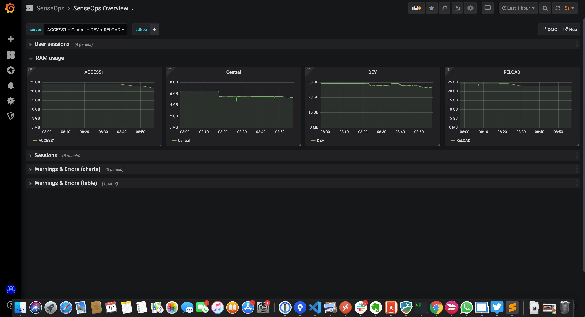
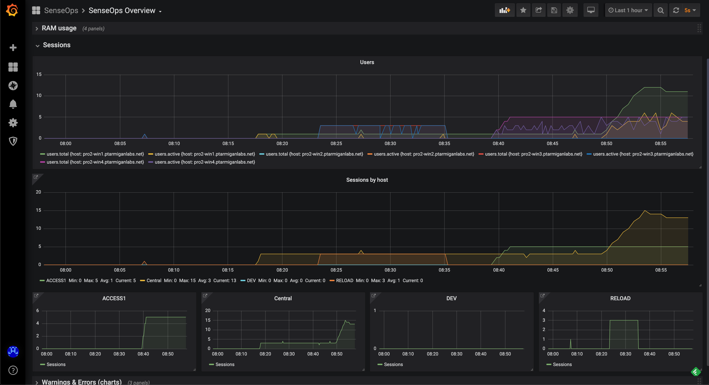
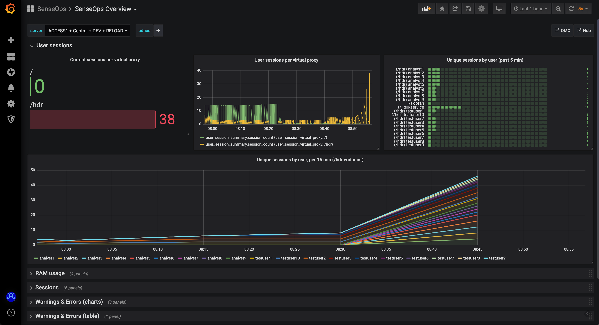
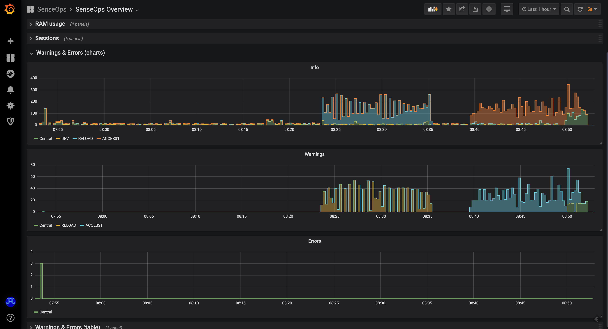

{}
Grafana is an increadibly capable tool for showing time series data.

The dashboards shown here are thus just examples and inspiration - feel free to extend and adapt these to meet your particular needs. There are also plenty of sample Grafana dashboards out there to get inspiration from.

If you experience issues with the Grafana dashboards included in the Butler SOS release on Github, you might want to try upgrading to a later/latest Grafana version.
{}

This is a top use case for Butler SOS.  
These kind of dashboards give you detailed insights into several important metrics for your Sense servers:

* CPU load
* Amount of free RAM memory
* Number of sessions in total
* Success rate of the Qlik engine's cache
* Number of loaded apps in the Qlik engine

A concept that has proven useful many times is to use an overview dashboard to monitors high-level metrics for the entire Sense cluster. A separate, parameterised dashboard then drill into the details for each server.

Sample dashboards are available in the [Git repository](https://github.com/ptarmiganlabs/butler-sos/tree/master/grafana).
Before importing these to Grafana you should create a Grafana data source called "SenseOps", and point it to your InfluxDB database. When you then import the dashboards they should find your database straight away.

## Overview dashboard

An overview dashboard could look something like this:

*RAM usage for each server*

Low memory alerts can be set (using Grafana's alert feature). Such alerts can be sent (using features built into Grafana) as notifications to Slack, Teams, Pager Duty, as email etc.

 

*General/high level user sessions info for both whole system and each server*

 

You can also get very detailed sessions metrics, down to the level of individual sessions per server and virtual proxy.

One possible use case for this information is to see what users will be affected by a pending server reboot. You could even use this information to send a chat message to these users, informing them that their connection to Sense will be lost in x minutes. This feature is not available in Butler SOS out of the box, but is quite possible to implement if needed.

As of Butler SOS v5.0.0, detailed user session metrics stored in a fairly comprehensive way in InfluxDB. The visualisation of these metrics is still kind of rough though. The charts below can serve as inspiration, but can surely be improved upon..

*Detailed user sessions info per server and virtual proxy*

 

When something breaks in a Qlik Sense environment the logs immediately fill up with warning and/or error messages. By keeping track of these it's easy to quickly spot (and get notified) issues when they first occur:

*Detailed user sessions info per server and virtual proxy*

Note how there are **lots** of INFO level messages generated (note the y axis scales in the diagram above!). 
In a production setting it's usually a good idea to turn off extraction of INFO level log messages into InfluxDB.

This is controlled in the [YAML config file](/docs/reference/config_file_format/).
