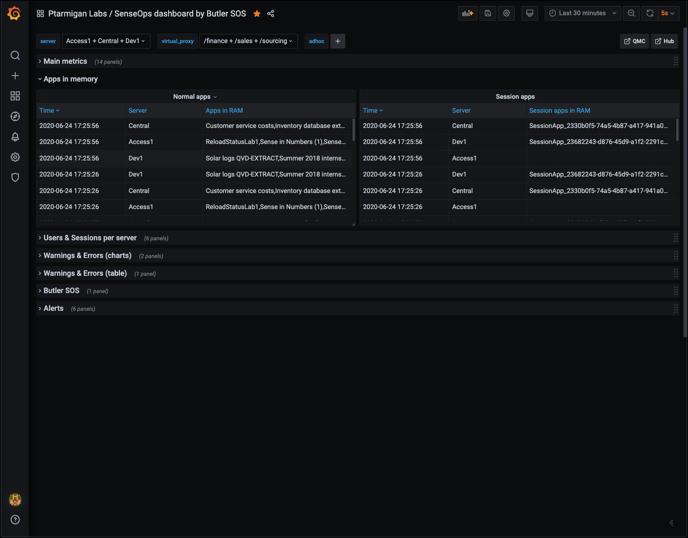
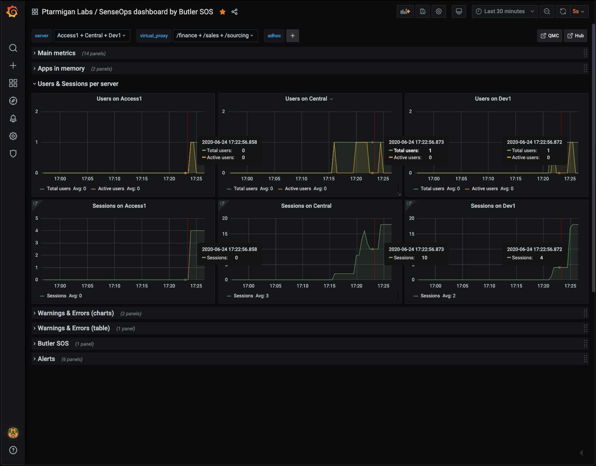
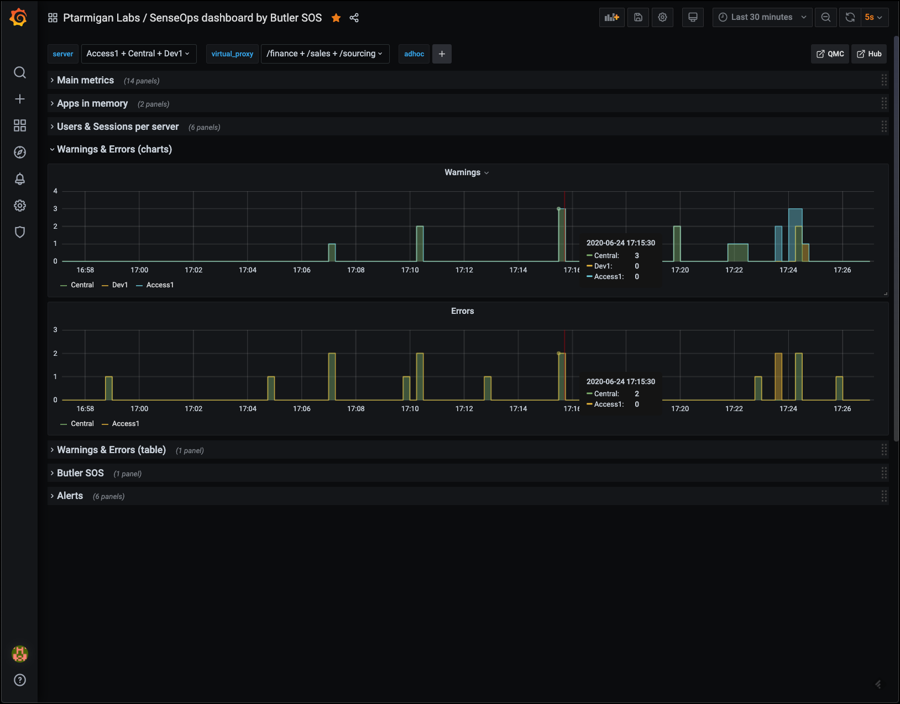
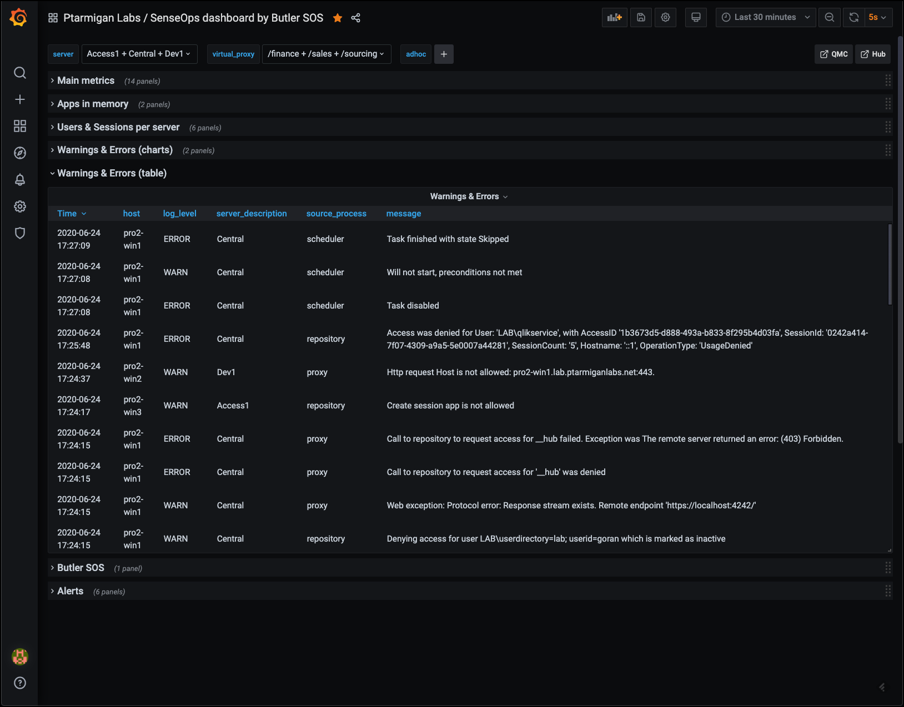
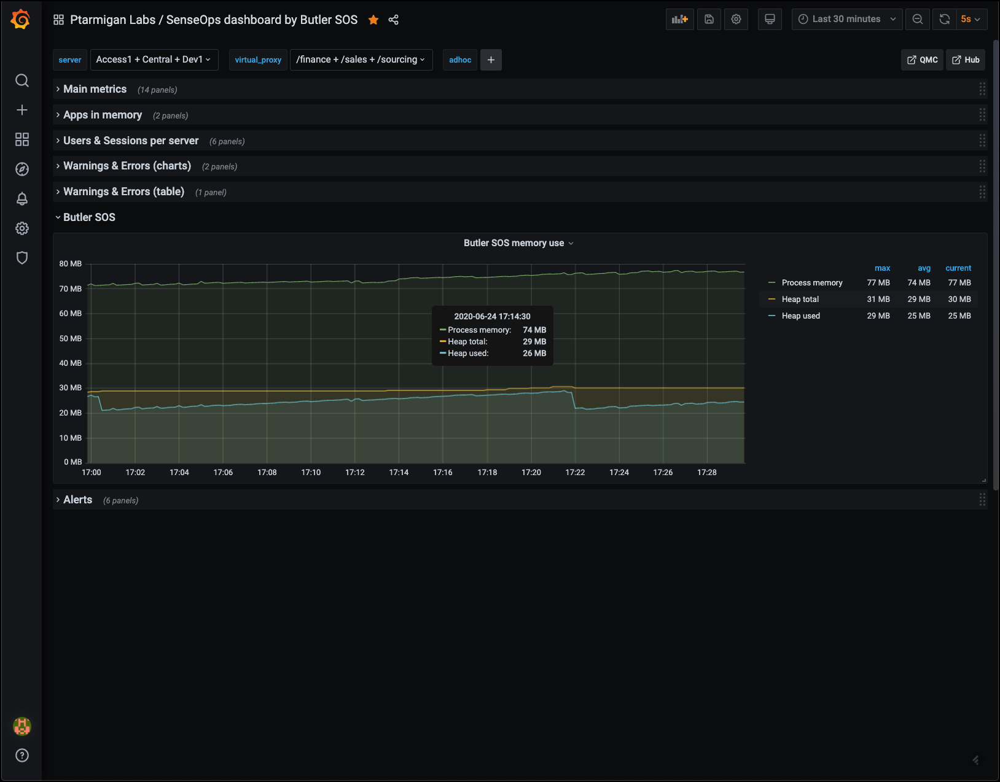
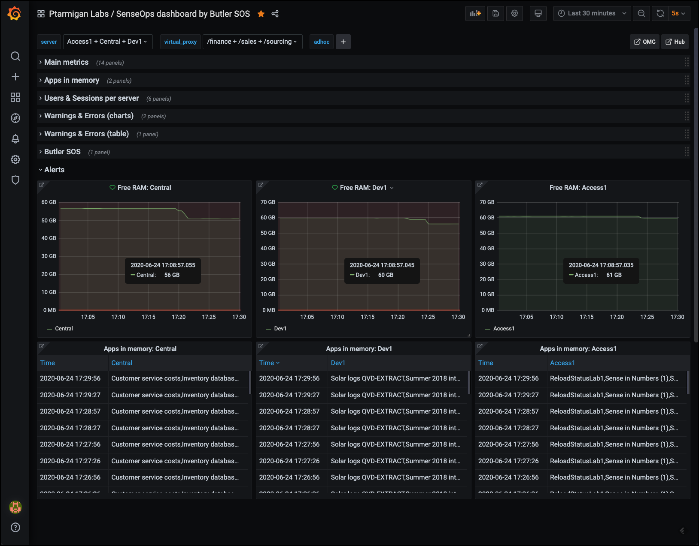

{}
The screen shots below are taken from the Grafana 7 sample dashboard [included in the Butler SOS repository](https://github.com/ptarmiganlabs/butler-sos/blob/master/grafana/senseops_v5_4_dashboard.json).

Feel free to modify it to your specific needs.
{}

A concept that has proven useful many times is to use an overview dashboard to monitors high-level metrics for the entire Sense cluster. A separate, parameterised dashboard then drill into the details for each server.

Sample dashboards are available in the [Git repository](https://github.com/ptarmiganlabs/butler-sos/tree/master/grafana).
Before importing these to Grafana you should create a Grafana data source called "SenseOps", and point it to your InfluxDB database. When you then import the dashboards they should find your database straight away.

## Overview metrics

This view gives high level insights into the 3 virtual proxies (/sales, /sourcing, /finance) in this particlar Sense environment, as well as top-level numbers on users and sessions.

*Top level metrics*

Low memory alerts can be set (using Grafana's alert feature). Such alerts can be sent (using features built into Grafana) as notifications to Slack, Teams, Pager Duty, as email etc.
To keep the dashboard nice and clean it's usually a good idea to put alert charts in their own section (see below for an example).

## Apps in memory

From a sysadmin perspective it's often interesting to know what apps are loaded into memory on each Sense server.

Here you get the details broken down by regular apps and session apps.  
You can also use Grafana's standard filtering features to narrow down on the server(s) of interest.

*Apps loaded into memory*

## Users & sessions per server

If things really go wrong wrong in a Qlik Sense Enterprise environment there connected users might be kicked out. It is therefore important to know at any given time how many users are connected, and be able to detect sudden drops in user count.

Another use case could be for maintenance windows: You then want to know how many - and which - users are connected, so you can send them a message that maintenance is about to start.

*Users and sessions per server*

## Warnings & Errors

This information is available in the standard Operations Monitor app in Qlik Sense Enterprise, but only in a retrospective way.  
Having access to it in close to real time makes it possible to act on developing issues quicker.

Charts provide overview while tables then give the actual messages, as they appear in the log files.

*Error and warning charts*

*Error and warning tables*

## Butler SOS metrics

Butler SOS is very robust indeed, but it may still be of interest to track its memory use, to make sure there aren't any memory leaks etc.

*Butler SOS memory usage*

## Alerts

While it's perfectly possible to include alerts in almost any Grafana chart, sometimes its nice to tuck the alert-enabled charts away, out of sight. They will do their job and alert when needed.

*Alerts*

