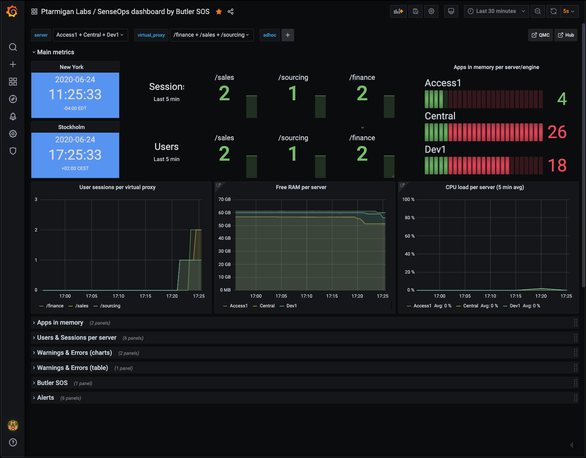
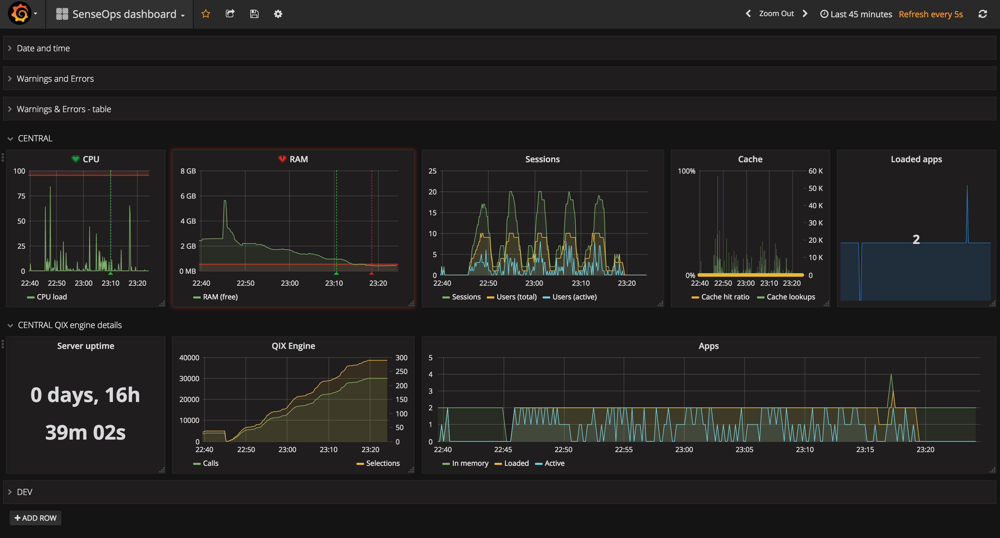

<!-- {}
This is a placeholder page that shows you how to use this template site.
{} -->

## Qlik Sense + DevOps = SenseOps

Butler SenseOps Stats ("Butler SOS") is a monitoring tool for [Qlik Sense](https://www.qlik.com/us/products/qlik-sense), built with DevOps workflows in mind.

It publishes operational, close to real-time Qlik Sense Enterprise metrics to [InfluxDB](https://www.influxdata.com/time-series-platform/influxdb/) and  [MQTT](https://en.wikipedia.org/wiki/MQTT), from where it can be charted using tools like [Grafana](https://grafana.com/) or acted on by downstream systems that listen to the MQTT topics used by Butler SOS.

Butler SOS gathers operational metrics from several sources, including the [Sense healthcheck API](https://help.qlik.com/en-US/sense-developer/June2020/Subsystems/EngineAPI/Content/Sense_EngineAPI/GettingSystemInformation/HealthCheckStatus.htm) and [Session API](https://help.qlik.com/en-US/sense-developer/June2020/Subsystems/ProxyServiceAPI/Content/Sense_ProxyServiceAPI/ProxyServiceAPI-Session-Module-API.htm).  
It also pulls log events from [Sense's Postgres logging database](https://help.qlik.com/en-US/sense-admin/June2020/Subsystems/DeployAdministerQSE/Content/Sense_DeployAdminister/QSEoW/Deploy_QSEoW/Qlik-Logging-Service.htm), and forwards these to InfluxDB and MQTT.

## Do I really need a tool like this?

Let's say you are somehow involved in (or maybe even responsible for) your company's Qlik Sense environemnt.

Let's also assume you have more than 5-10 users in your Sense environment. Maybe you even have business critical data in your Sense apps.

Given the above, the answer is almost certainly "yes" : You can simplify your workday and provide a better analytics experience to your end users by using a tool like Butler SOS.

## Why a separate tool for this?

Good question.  

While Qlik Sense ships with a great Operations Monitor application, it is not useful or intended for real-time operational monitoring.  
The Ops Monitor app is great for retrospective analysis of what happened in a Qlik Sense environment, but for a real-time understanding of what's going on in a Sense environment something else is needed - enter Butler SOS.

The most common way of using Butler SOS is for creating real-time dashboards based on the data in the InfluxDB database, showing operational metrics for a Qlik Sense Enterprise environment.  
  
Sample screen shots of [Grafana](https://grafana.com/) dashboards created using data extracted by Butler SOS:

As mentioned above, Butler SOS can also send data to [MQTT](https://en.wikipedia.org/wiki/MQTT), for use in any MQTT enabled tool or system.

## Known limitations & improvement ideas

Things can always be improved, of course. Here are some ideas on things for future versions:

- The MQTT messages are kind of basic, at least when it comes to data from the Sense logs and for detailed user sessions. In both those cases a single text string is sent to MQTT. That's fine, but assumes the downstream consumer of the MQTT message can parse the string and extract the information of interest.  
  A better approach would be to send more detailed MQTT messages. Those would be easier to consume and act upon for downstream systems, but it would on the other mean  **lots** more MQTT messages being sent. 
- Send data as Kafka messages. Same basic idea as for MQTT messages, but having the Sense operational data in Kafka would make it easier to process/use it in (big) data pipelines.
- Expose metrics via Prometheus. This would mainly be an alternative to using InfluxDB as a datastore, as Grafana is commonly used as a frontend for Prometheus.

If you have ideas or suggestions on new features, please feel free to add them in the [Butler SOS Github project](https://github.com/ptarmiganlabs/butler-sos/issues/new/choose).

## Where should I go next?

Ready to move on?

Great! Here are some good starting points

- [Getting Started](/docs/getting_started/): Get started with Butler SOS
- [Examples](/docs/examples/): Check out some example monitoring dashboards!

## I have a question or want to report an issue

Feel free to reach out via a [GitHub issue](https://github.com/ptarmiganlabs/butler-sos/issues), or by email to info@ptarmiganlabs.com.

## Security / Disclosure

If you discover any important bug with Butler SOS that may pose a security problem, please disclose it confidentially to [security@ptarmiganlabs.com](mailto://security@ptarmiganlabs.com) first, so that it can be assessed and hopefully fixed prior to being exploited. Please do not raise GitHub issues for security-related doubts or problems.

## Who's behind Butler SOS?

Butler SOS is an open source project sponsored by [Ptarmigan Labs](https://ptarmiganlabs.com), an IT consulting company in Stockholm, Sweden. The main contributor to the tool is (so far) [Göran Sander](https://www.linkedin.com/in/gorsan) from same company. 

Please refer to the [Contribution guidelines](/docs/contribution-guidelines/) page for details on how to contribute, suggest features etc to the tool.
