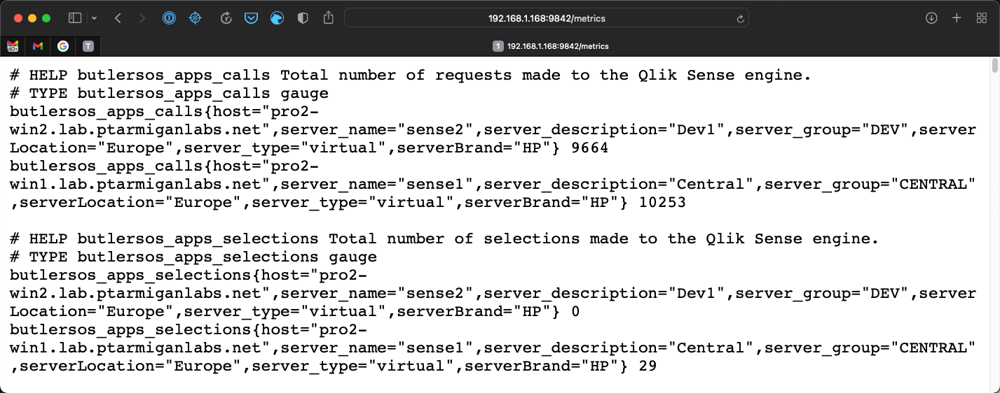

## Prometheus

Metrics retrieved from the Sense servers can be stored in [Prometheus](https://prometheus.io). You don't have to be a Prometheus expert to use Butler SOS, but understanding some basic concepts are helpful.  

Storing metrics in Prometheus is not mandatory, but some kind of metrics storage - either in Prometheus, [InfluxDB](/docs/reference/available_metrics/influxdb/) or [New Relic](https://newrelic.com) - is needed to take full benefit of Butler SOS' features.

Prometheus gathers metrics by "scraping" data from web pages ("endpoints") on which metrics are displayed in a well specified format.  
Most metrics from the Sense servers are exposed on a Prometheus compatible endpoint, but not all.  
InfluxDB is more flexible for some types of data, while Prometheus provides more easily used features for data aggregation when data should be displaued in Grafana.  

## Prometheus endpoint

Prometheus is enabled/disabled in the `Butler-SOS.prometheus` section in the config file.
Prometheus metrics are available on the `/metrics` URL on the IP and port specified in the config file.

For example, if the host is 0.0.0.0 and the port is 9842, Butler SOS will listen on port 9842 on all available network interfaces. 
If the Butler SOS' server's IP address is 192.168.1.168, a call from a web browser can look like this:

  

This is the web page Prometheus will scrape and ingest into it's time-series database.

### Overview of Prometheus

In contrast to InfluxDB, to which Butler SOS pushes data, Prometheus works the other way around.  
The Prometheus server is responsible for gathering data exposed by the systems that should be monitored (for example Butler SOS).

The basic concepts are

* [Metrics](https://prometheus.io/docs/introduction/overview/#what-are-metrics) represent the measurements of interest. "fields" in InfluxDB.
* [Labels](https://prometheus.io/docs/concepts/data_model/#metric-names-and-labels) are used to categorize metrics (similar to tags in InfluxDB).

### Labels

The labels available for all Prometheus metrics are:

| Label name | Source | Description |
| ----------| -----| ----------- |
| host | `Butler-SOS.serversToMonitor.servers[].host` | Host IP or FQDN of the server from which the metric comes. |
| server_name | `Butler-SOS.serversToMonitor.servers[].serverName` | Human friendly server name. |
| server_description | `Butler-SOS.serversToMonitor.servers[].serverDescription` | Human friendly server description. |
| ... | `Butler-SOS.serversToMonitor.servers[].serverTags.*` | All tags defined in the config file will be added as Prometheus labels. |

### Metrics

Available metrics are similar to those in InfluxDB, with a few exceptions.

Prometheus is awesome when it comes to storing all kinds of measurements, but it doesn't offer a good way to store strings.  
For that reason Butler SOS metrics involving strings (for example list of apps loaded in memory) are not available on the Prometheus endpoint.  
Most of the metrics come from Qlik Sense' [health check API](https://help.qlik.com/en-US/sense-developer/November2020/Subsystems/EngineAPI/Content/Sense_EngineAPI/GettingSystemInformation/HealthCheckStatus.htm).

#### Qlik Sense metrics

These are the Prometheus metrics exposed by Butler SOS:

| Metric | Type | Description |
| ----------| -----| ----------- |
| butlersos_apps_calls | Gauge | Total number of requests made to the Qlik Sense engine. |
| butlersos_apps_selections | Gauge | Total number of selections made to the Qlik Sense engine. |
| butlersos_apps_activedocs_total | Gauge | Number of active apps. An app is active when a user is currently performing some action on it. |
| butlersos_apps_inmemorydocs_total | Gauge | Number of apps apps currently loaded into memory, even if they do not have any open sessions or connections to it. Apps disappear from this metric when the engine has purged them from memory. |
| butlersos_apps_loadeddocs_total | Gauge | Number of apps apps currently loaded into memory, that also have open sessions or connections. |
| butlersos_cache_added | Gauge | Number of cache objects added. |
| butlersos_cache_hits | Gauge | Number of cache hits. |
| butlersos_cache_lookups | Gauge | Number of cache lookups. |
| butlersos_cache_replaced | Gauge | Number of cache replaced cache objects. |
| butlersos_cache_saturated | Gauge | When the value is 1, the engine is running with high resource usage; otherwise the value is 0. |
| butlersos_cpu_total | Gauge | Percentage of the CPU used by the engine, averaged over a time period of 30 seconds. |
| butlersos_mem_committed | Gauge | The total amount of committed memory for the engine process in MB. |
| butlersos_mem_allocated | Gauge | The total amount of allocated memory (committed + reserved) from the operating system in MB. |
| butlersos_mem_free | Gauge | The total amount of free memory (minimum of free virtual and physical memory) in MB. |
| butlersos_session_active | Gauge | Number of active engine sessions. A session is active when a user is currently performing some action on an app, for example, making selections or creating content. |
| butlersos_session_total | Gauge | Total number of engine sessions. |
| butlersos_users_active | Gauge | Number of distinct active users. An active user is one who is currently performing an action on an app. |
| butlersos_users_total | Gauge | Total number of distinct users within the current engine sessions. |
| butlersos_engine_metadata | Gauge | Metadata about the Qlik Sense engine. |
| butlersos_user_session_total | Gauge | Number of sessions (as reported by the proxy service). |

#### Node.js metrics

A set of Node.js specific metrics are also available on Butler SOS' Prometheus endpoint.  
These are described in the "Default metrics" section on [this](https://github.com/siimon/prom-client) page.
