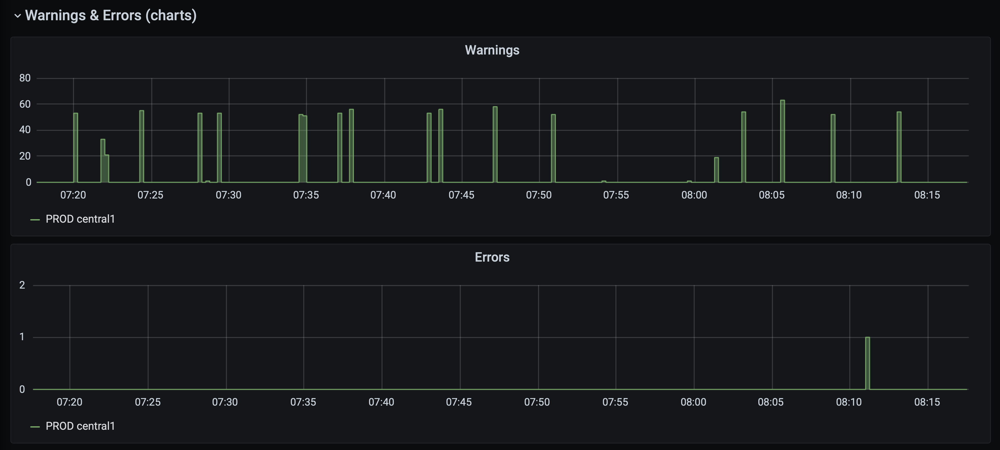
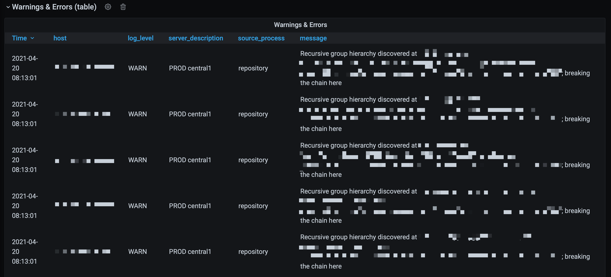
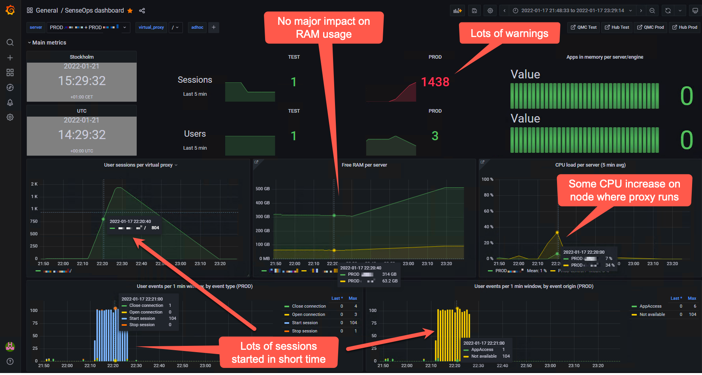

## Sense log events

Sense creates a large number of log files for the various parts of the larger Qlik Sense Enterprise environment.  
Those logs track more or less everything - from extensions being installed, users logging in, to incorrect structure of Active Directory user directories.

Butler SOS monitors select parts of these logs and provides a way to get an aggregated, close to real-time view into warnings and errors.

The [log events](/docs/getting_started/setup/log-events/) page has more info on this.

## Grafana dashboards

Butler SOS stores the log events in InfluxDB together with all other metrics.  
It is therefore possible to create Grafana dashboards that combine both operational metrics (apps, sessions, server RAM/CPU etc) with warning and error related charts and tables.

Showing warnings and errors visually is often an effective way to quickly identify developing or recurring issues.  

### Example 1: Circular Active Directory references

Here is an example where bursts of warnings tell us visually that something is not quite right.  
50-60 warnings arriving in bursts every few minutes - something is not right.  
There is also a single error during this time period - what's going on there?

We can then look at the actual warnings (=log events) to see what's going on.

In this case it turns out to be circular references in the Active Directory data used in Qlik Sense.  Not a problem with Sense per se, but still something worth looking into:

  

  

Looking at that single error then, it turns out it's caused by a task already running when it was scheduled to start:

  

### Example 2: Session bursts causing proxy overload

This example is would have been hard or impossible to investigate without Butler SOS.

The problem was that the Sense environment from time to time became very slow or even unresponsive. A restart solved the problem.

Grafana was set up to send alerts when session count increase very rapidly. Thanks to this actions could be taken within minutes from the incident occuring.  

Looking in the Grafana dashboard could then show something like below.  
New sessions started every few seconds, all coming from a single client. The effect for this Sense user was that Sense was unresponsive.  

The log events section of the Grafana dashboard showed that this user had been given 5 proxy sessions, after which further access to Sense internal resources (engine etc) was denied.

  

In this case the problem was caused by a mashup using iframes that when recovering from session timeouts caused race conditions, trying to re-establish a session to Sense over and over again.

## Alerts

Grafana includes a set of built-in alert features that can be used to set up alerts as well as forward them to destinations such as Slack, MS Teams, email, Discord, Kafka, Webhooks, PagerDuty and others.

More info about Grafana alerts [here](https://grafana.com/docs/grafana/latest/alerting/notifications/).
