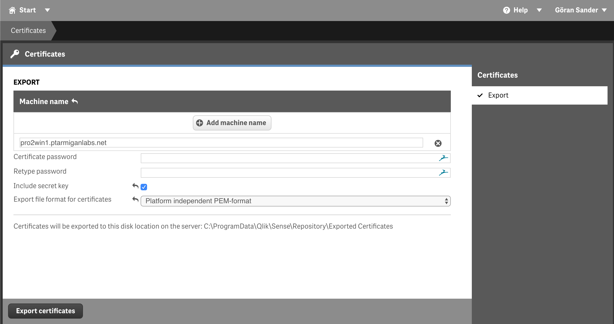

{}
These settings are mandatory.  
They must exist in the config file and be correctly set for Butler SOS to work.
{}

## What's this?

In order to interact with a Qlik Sense Enterprise on Windows (QSEoW) environment, Butler SOS needs to know a few things about that environment. This is true no matter if the Sense cluster consists of a single Sense server or many.

## Settings in main config file

```yaml
---
Butler-SOS:
  ...
  ...
  # Certificates to use when connecting to Sense. Get these from the Certificate Export in QMC.
  cert:
    clientCert: <path/to/cert/client.pem>
    clientCertKey: <path/to/cert/client_key.pem>
    clientCertCA: <path/to/cert/root.pem>
    clientCertPassphrase: <certificate key password, if one was specified when exporting certificates from Sense QMC >
    # If running Butler in a Docker container, the cert paths MUST be the following
    # clientCert: /nodeapp/config/certificate/client.pem
    # clientCertKey: /nodeapp/config/certificate/client_key.pem
    # clientCertCA: /nodeapp/config/certificate/root.pem
    # clientCertPassphrase: 
  ...
  ...
```

## Qlik Sense certificates

Butler SOS uses certificates to authenticate with Qlik Sense.  
These certificates must be exported from the Qlik Management Console (QMC).


To export certificates you need to provide a few pieces of information:  

1. The IP or full host name that Butler SOS' will use when calling Butler SOS APIs.
  For example, if Butler SOS get data from `server1.my.domain` (i.e. the config setting `Butler.serverToMonitor.server.host` is set to `server1.my.domain`), the value `server1.my.domain` should be entered as "machine name" when exporting the certificates from the QMC.
2. You only need to export certificate from one server in multi-server Sense clusters. The exported certificate can be used to access and get data from any server in the cluster.
3. Butler SOS can handle certificates with or without password protection. If you choose to use a password, you must enter that password in the Butler SOS config file.
4. Check the "Include secret key" check box.
5. Export certificates in PEM format.



Then click the "Export certificates" button. If all goes well the certificates are now exported to a folder on the Sense server to which you are connected (i.e. the server hosting the virtual proxy you are connected to):


The exported certificate files will be used when [configuring Butler SOS](/docs/reference/config_file_format/).
